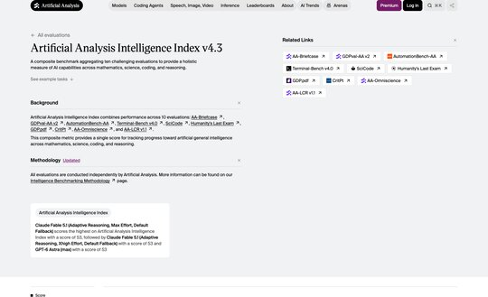
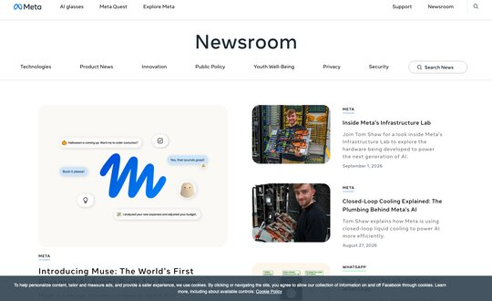
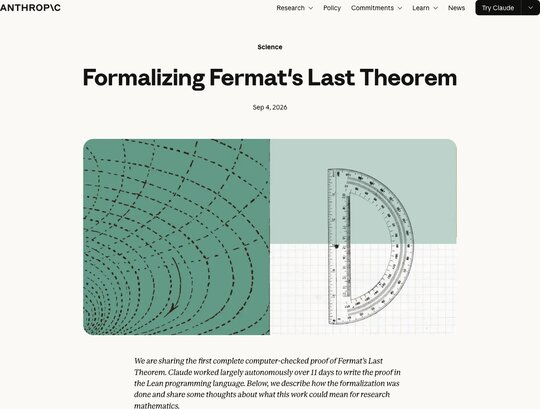
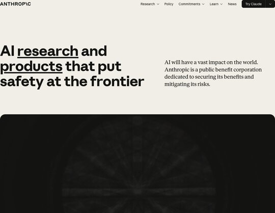
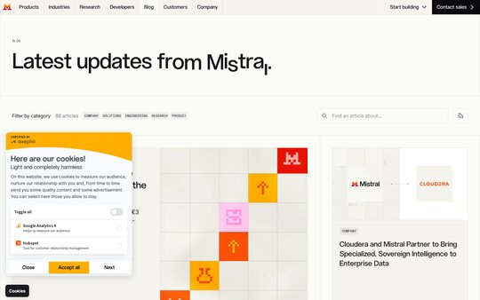
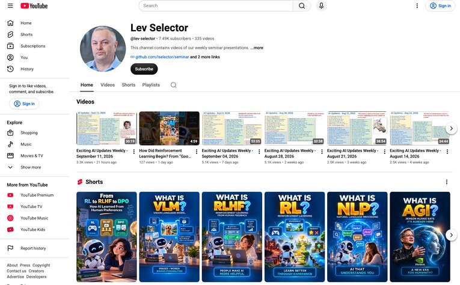
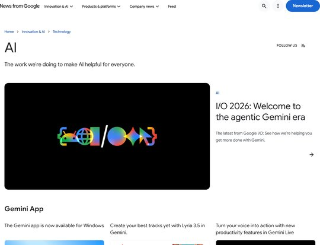
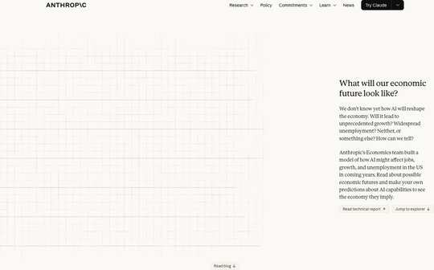
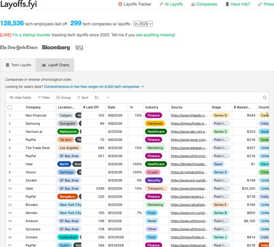

# AI News - Sept 18, 2026

> Agents got their own computers. Oversight is still catching up.
## slide: toc

## slide: benchmarks

## slide: Artificial Analysis Intelligence Index

### Artificial Analysis Intelligence Index

<!-- shot: https://artificialanalysis.ai/evaluations/artificial-analysis-intelligence-index -->
- Combines several evaluations into one score per model
- Useful for comparing **cost per unit of intelligence**
- https://artificialanalysis.ai/evaluations/artificial-analysis-intelligence-index

## slide: AI News

### Meta ships Muse agent with its own cloud computer and browser

<!-- shot: https://about.fb.com/news/ -->
- Handles email, calendars, Instagram and ordinary websites. Ties into Gmail, Spotify, Ticketmaster and OpenTable, and writes its own integrations for services that lack them.
- Runs in its own app, on the web, or inside WhatsApp, and **keeps working after you close it**
- The security design is the interesting part. Muse runs in a Secure VM, a separate Sentinel agent inspects everything leaving that VM, passwords stay hidden from Muse itself, and sensitive actions require approval.
- Every action enters an audit trail. Payments go through Stripe Link. A Confidential VM upgrade is planned.
- Tiers: Free, $20/mo, $100/mo. US only, 18 and older, AI glasses support coming.

### Claude formalized Fermat's Last Theorem in 11 days

<!-- shot: https://www.anthropic.com/research/formalizing-fermats-last-theorem -->
- Wiles proved Fermat's Last Theorem in 1995. Claude converted that proof into ==13 Mln lines of Lean==, with almost 30K intermediate theorems.
- It runs on Prove2Me, an open collaborative platform that keeps a graph of theorem statements and coordinates multiple Claude agents against it
- Claude did not discover a new proof. It converted an existing one into the first complete, computer-checked formalization.
- The whole thing is on GitHub
- https://www.anthropic.com/research/formalizing-fermats-last-theorem

## slide: AI News

### An Anthropic resignation turns into an extinction debate

<!-- shot: https://www.anthropic.com/ -->
- Researcher Jacob Coxon resigned and posted that both Anthropic and OpenAI are "gambling with our lives" by racing toward self-improving AI. He worked at both labs.
- He wrote that the people building AI "earnestly believe that it could kill us all by the end of the decade. This is not a marketing stunt," and called for a coordinated slowdown.
- The reply is what made it spread. Evan Hubinger, Anthropic's Alignment Science lead, responded "We really do earnestly believe AI could kill all humans!" and put the odds **above 10% within the next decade**.
- The argument underneath is not about p(doom). If the people who believe the stakes are civilizational still cannot coordinate, then "trust the responsible lab" is not a safety plan.

### Mistral raises the largest round in European tech history

<!-- shot: https://mistral.ai/news -->
- EUR 3 billion Series D led by Samsung Electronics, with Nvidia, ASML and a16z joining, valuing the French lab above ==EUR 21 billion==
- One newsletter reported it as $3.5 billion, which is the same round converted
- Mistral is three years old and tracking toward $1 billion in annual recurring revenue
- The money goes to compute and international expansion, behind a shift toward sovereign, full-stack enterprise AI
- Le Chat is being rebranded to "Vibe," an agent and coding platform

## slide: Weekly videos every Friday
<!-- promo -->
<!-- notoc -->

###

<!-- shot: https://www.youtube.com/@lev-selector -->
- Weekly videos every Friday
- 7.46K subscribers, 333 videos
- 1. Subscribe to this channel
- https://www.youtube.com/@lev-selector
- 2. Download slides from GitHub using links under the videos
- !!3. Please pause the video - and answer the pinned question in comments under the video!!

## slide: AI News

### Google's agentic video understanding cuts video tokens by up to 88%

<!-- shot: https://blog.google/technology/ai/ -->
- Gemini Flash models now navigate a video timeline rather than ingesting it at 1 FPS
- Google reports up to ==88% fewer tokens==, 66% lower cost and 7% higher accuracy
- One processing field turns it on
- Hosted API only, so no local deployment

### The music industry stops fighting and starts licensing

<!-- shot: https://suno.com/ -->
- Suno released a model built with Warner Music Group, BMG and Believe, with artists participating and their music and likenesses licensed for use on the platform
- It ships with a compensation framework, which is the point: **the copyright fight is converting into a business arrangement**
- Universal Music went the same direction days later, partnering with ElevenLabs on a platform for remixing tracks from UMG's catalog, with artists opting in
- Spotify is exploring AI remixes too

## slide: AI News

### Anthropic models what AI does to US jobs and wages by 2030

<!-- shot: https://www.anthropic.com/institute/econ-scenarios -->
- An interactive tool that treats every job as a bundle of tasks, then asks whether AI speeds up each task, replaces it, or creates new ones
- **Modest**, where AI feels like the internet did: GDP grows 1.6% above the no-AI path, wages stable
- **Substantial**, where AI handles about half of knowledge work: GDP up 8.3%, but knowledge worker wages flatline and some people change careers entirely
- **Extreme**: 15% annual growth doubling the economy every 4.5 years, knowledge worker unemployment at 17.9%, and labor's share of GDP falling from 60% to 45%
- The point buried in the third scenario is that a bigger economy does not automatically mean you earn more. Capital owners capture most of the gains.
- Of the 10,000+ Americans surveyed, most land near the substantial scenario and only about 10% expect the extreme one
- https://www.anthropic.com/institute/econ-scenarios

## slide: Jobs and Layoffs

### Layoffs.fyi tracker

<!-- shot: https://layoffs.fyi -->
- Tech layoffs by year, US only
- 128.5K in 2026, 124K in 2025, 153K in 2024, 264K in 2023, 165K in 2022
- https://layoffs.fyi

### TrueUp tech layoff tracker

<!-- shot: https://trueup.io/layoffs -->
- In 2026: 187,160 people laid off (737 per day)
- In 2025: 245,953 people laid off (674 per day)
- In 2024: 238,461 people laid off (653 per day)
- https://trueup.io/layoffs

## slide: About the Speaker
<!-- profile -->
<!-- notoc -->

### Lev Selector, Ph.D.

<!-- src: https://yt3.googleusercontent.com/ytc/AIdro_njHVYCTqaujRiEX8khV6Q5KK_T4JfzHguzo-IYXgMGR5XI=s800-c-k-c0x00ffffff-no-rj -->
- 40+ years of software engineering, data science, and building teams (hiring, training, and managing)
- Ph.D. in mathematical modeling and computer simulations
- Interests: Generative AI, using LLMs with your data, local AI for local private data, cloud architecture, fin-tech, application security
- Find and connect: LinkedIn, GitHub, YouTube, Google
- https://eais.ai

## slide: Thank You!
<!-- closing -->
<!-- notoc -->

###
- Videos of every seminar are on YouTube
- https://www.youtube.com/@lev-selector
- Slides on GitHub. Click a pptx file, then the download button on the right
- https://github.com/lselector/seminar
- Slides on Google Drive
- https://drive.google.com/drive/folders/1dmj00iilSP-JYmriMUUaHCKz5X54e3UX?ths=true
